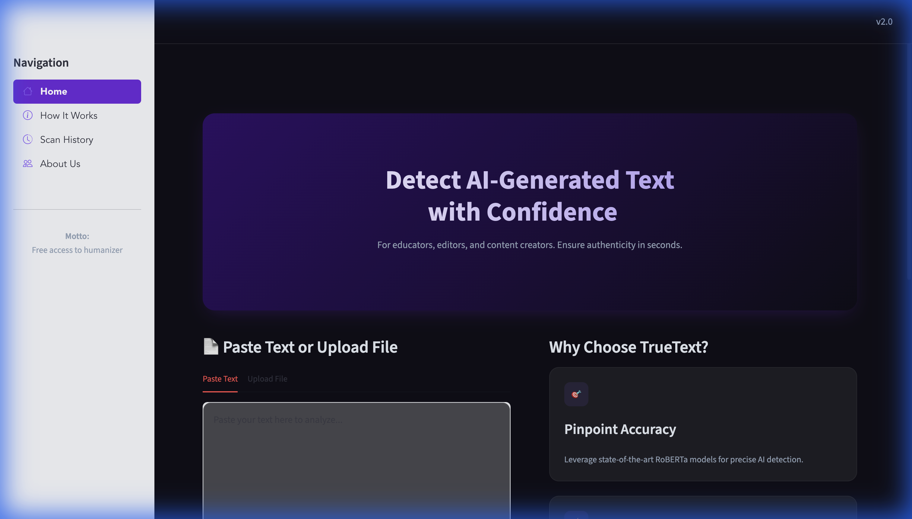

# TrueText: AI Essay Detector & Humanizer

<p align="center">
  
</p>

TrueText is a powerful Python application built with Streamlit that helps you detect AI-generated content and humanize it to bypass detection.

## Screenshot



## Features

-   **🕵️ AI Detection**: Uses the `roberta-base-openai-detector` model to analyze text and identify AI-generated sentences.
-   **📊 Visual Scoring**: Displays a dynamic gradient circle (Green to Red) indicating the probability of AI content.
-   **🖍️ Smart Highlighting**: Automatically highlights "Fake" (AI-generated) sentences in red for easy identification.
-   **✨ Humanizer**: Utilizes the `tuner007/pegasus_paraphrase` model to rewrite text and make it sound more natural.
-   **📁 File Upload**: Support for PDF, DOCX, and TXT files.
-   **📜 Scan History**: Automatically saves your analysis history locally.
-   **📥 PDF Export**: Download detailed analysis reports as PDF.
-   **📖 How It Works**: Learn about the detection process with our guide.
-   **🚀 Fast & Efficient**: Caches models for quick loading and performance.

## Installation

1.  **Clone the repository**:
    ```bash
    git clone https://github.com/RnR-io/TrueText.git
    cd TrueText
    ```

2.  **Install dependencies**:
    ```bash
    pip install -r requirements.txt
    ```

## Usage

Run the application using Streamlit:

```bash
streamlit run app.py
```

1.  **Paste Text or Upload File**: Enter your essay or upload a document (PDF, DOCX, TXT).
2.  **Detect**: Click "Analyze Text" to see the AI probability score and highlighted analysis.
3.  **Humanize**: Click "Humanize" to rewrite the text.
4.  **Export**: Download your analysis report as PDF.
5.  **View History**: Check your past scans in the History tab.

## Technologies

-   **Streamlit**: For the interactive web interface.
-   **Transformers (Hugging Face)**: For loading state-of-the-art NLP models.
-   **Torch**: Deep learning framework backend.
-   **NLTK**: For sentence tokenization.
-   **FPDF**: For PDF report generation.
-   **python-docx & PyPDF2**: For document parsing.

## License

This project is open-source and available under the MIT License.

---

**TrueText** - An RnR-io Project © 2024

